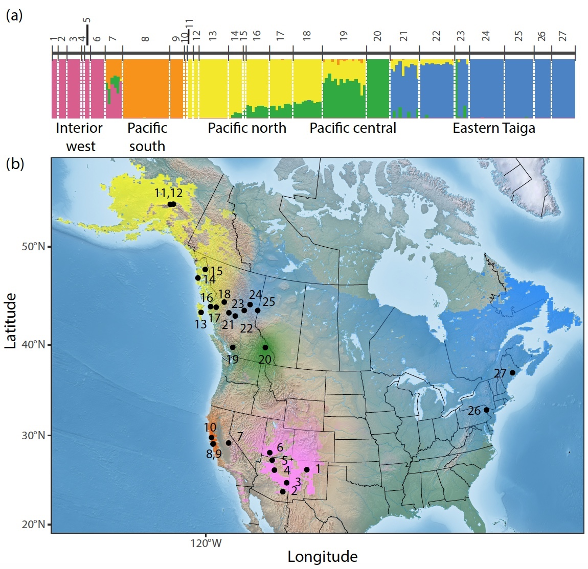

```{r setup, include=FALSE}
knitr::opts_chunk$set(echo = TRUE)
```

## Libraries needed
I'll have you download multiple programs that will not only allow you to assign individuals to breeding group based on their genotypes, but also plot this information in space. 

#### If you have an older version of R, install ggiraph first
```{r}
#install.packages("ggiraph")
##Answer no to Do you want to install from sources the package which needs compilation?

##Or if you don't get that message (an older R version), just say yes to restarting R to update packages
```

#### Then restart R to install and load the rest of packages

```{r, echo=FALSE}
library(raster)  # important to load before tidyverse, otherwise it masks select()
library(tidyverse)
library(sf)
library(ggspatial)
library(rubias)
#install.packages("OriGen", repos="http://R-Forge.R-project.org")
library(OriGen) #version 1.64
library(RColorBrewer)
library(ggplot2)
library(ggpubr)
#This is the function that calculates the distance between predicted lat/long and the lat/long in the meta data file
library(geosphere)
library(rworldmap)
library(spatialEco)
library(dplyr)
library(reshape2)
library(plotly)
library(ggiraph)
library(rnaturalearth)
library(xlsx)
```

## Population structure

For the first part of the tutorial, we illustrate how we defined Hermit Thrush population structure based on RADseq data. 

The genoscape can be thought of as the bright colors smeared across space that show where different
genetically identifiable groups of birds reside on the breeding grounds.  These genoscapes
are stored as rasters, and transparency is used to indicate how much confidence one has
in the genetic identification of individuals in different areas.  These rasters are made
by interpolating Q-values from a program like STRUCTURE or ADMIXTURE between individuals
that were sampled in space. __For the sake of the project figures, if you want this genoscape (or AMKE's genoscape), I can help you create it to put the results we generate below in context, but we ultimately don't need it for today's tutorial. Ask me after__

```{r, echo=FALSE, out.width="50%", fig.cap="HETH genoscape"}

```


The question is: how well did we recreate the genetic clusters? I've run a quick and dirty PCA in plink. Below, plot the results using the code in the code chunk.

```{r}
##RAD only data
pc<-read_delim("HETH.breeding.4Origen.eigenvec",delim="\t") %>% rename(Sample=IID)

##RAD + Fluidigm data of breeding birds
pc<-read.delim("HETH.breeding_inclNew.eigenvec",sep="\t") %>% rename(Sample=IID)

meta_breed<-read_csv("HETH.breeding.meta.final_fixed2.csv")
pca<-pc %>% left_join(meta_breed)

p<-pca %>% ggplot()+geom_point(aes(PC1,PC2,col=GeneticCluster))+
  theme_classic()

p
```

#### Can make these plots interactive

This is super cool, but right now it's just giving you information that is on the plot and maybe not information you want (aka what individual is weird in the PCA?).

```{r}
interactive_plot <- ggplotly(p)
interactive_plot
```

#### Can add more information to each point using a package called ggiraph

```{r}
p_interactive <- ggplot(pca, aes(x = PC1, y = PC2, color = GeneticCluster,
                                      tooltip = paste("Bird:", Sample, "\nLocation:",ClimGroup, "\nGeneticCluster:", GeneticCluster))) +
      geom_point_interactive(aes(data_id = Sample)) +
      labs(title = "HETH PC1 vs. PC2 (Interactive)") +ylim(-0.20,0.06) + theme_classic()

girafe(ggobj = p_interactive)
```
`

Note, the color coding is based on how we defined the Genetic Cluster. This needs to be defined _a priori_. Let's create another plot where we exclude potential hybrid populations- or just merge them together in color space, based on this Fluidigm data.

```{r}
pca_filt<-pca %>% filter(!grepl("_hyb", GeneticCluster)) 

p_interactive_filt <- ggplot(pca_filt, aes(x = PC1, y = PC2, color = GeneticCluster_Fluidigm,
                                      tooltip = paste("Bird:", Sample, "\nLocation:",ClimGroup, "\nGeneticCluster:", GeneticCluster_Fluidigm))) +
      geom_point_interactive(aes(data_id = Sample)) + ylim(-0.20,0.06) + 
      theme_classic() +
      labs(title = "HETH PC1 vs. PC2 (Interactive)")

girafe(ggobj = p_interactive_filt)
```

Click on first icon in window __Show in New Window__, which allows you to  look at this figure in a larger context with all the axes in view.

__1. How many MAIN clusters do you see?__

For the sake of today's tutorial, I've created the reference files for rubias that reflects the second PCA plot, cleaned up. Those weird individuals are removed, and I've remove those intermediate/hybrid individuals and only kept individuals that clearly cluster together. 

#### Breeding Bird Shapefile

Finally, we need to have a GIS Shapefile that tells us the range of the breeding birds, so that genoscape can be clipped properly.  We read this shapefile with the 
`st_read()` function from package `sf`. 
See code below. This also comes in handy for looking at probabilty of spatial assignment in OriGen, the second analysis we'll do today.

```{r}
breeding<-st_read("HETH_eBird/herthr_range_2020.gpkg") %>% filter(season=="breeding")
```
We may or may not look at shapefile. It's quite large, so it's commented out now.

```{r}
ggplot() +
  ggspatial::layer_spatial(breeding) +
  theme_bw()
```

## Population assignment using rubias

Rubias is an R software program that probabilistically assigns individuals to specific reporting units (i.e. genetic clusters diagnosed in the breeding region). Originally used for fish stock identification, we've co-opted it for bird genoscapes! I've attached the two rubias files you'll need. The known breeder genotypes and the genotypes of the migrating birds. Note, since we don't know where the migrating birds are coming from, we consider them unknown and we are going to use rubias to estimate mixing proportions and probability of assignment to their breeding origin. Thus, we consider the unknown birds a potential *mixture* of individuals from distinct genetic clusters.

Read in this data, and double check that it doesn't have an extra column for whatever reason at the end. 

This code formats data. You don't need to worry about this, because I already did, but you might need to think about this for your project data!

```
heth_mix2 <- read.delim("HETH.migrating.rubias_input.txt",sep="\t") %>% distinct() 
heth_mix2[,-(1:4)][heth_mix2[,-(1:4)] == 0] <- NA
heth_mix2[,-(1:4)][heth_mix2[,-(1:4)] == "A"] <- "1"
heth_mix2[,-(1:4)][heth_mix2[,-(1:4)] == "C"] <- "2"
heth_mix2[,-(1:4)][heth_mix2[,-(1:4)] == "G"] <- "3"
heth_mix2[,-(1:4)][heth_mix2[,-(1:4)] == "T"] <- "4"
heth_mix2 %>% write.table("HETH.migrating.rubias_input_mix_fix.txt",row.names = F,quote=F,sep="\t")
heth_mix2 <- read.delim("HETH.migrating.rubias_input_mix_fix.txt",sep="\t") %>% distinct() 
```


#### Organizing and filtering the data

Again, not something to worry about immediately, because you have a super clean data set to work with, but organizing data is important.Because reference and mixture files need to be in same order (assays in the same columns), I find it's easier to combine the files together, and then filter the mixture samples out. Using full join of the heth_ref2 (from below), places all the assays in order. Also, when you are analyzing one SNP-type run, sometimes some assays fail for the mixture but not the reference birds. These variants need to be removed from the analysis too, for both data sets. Below code does this as well. Normally if a run "fail", we'll do a re-run, however, if only a couple assays fail, we can still successfully use the remaining assays to assign individuals.

```
heth_ref2 %>% full_join(heth_mix2) %>% filter(sample_type=="mixture") %>% dplyr::select(-ETai_PCent12,-ETai_PCent12b,-ETai_PCent15,-ETai_PCent15b,-ETai_PCent16,-ETai_PCent16b,-ETai_PNorth,-ETai_PNorthb,-ETai_PCent13,-ETai_PCent13b,-ETai_PCent14,-ETai_PCent14b) %>%  write.table("HETH.Tomas_call.rubias_input_fix2.txt",row.names = F,quote=F,sep="\t")
heth_ref2 %>% full_join(heth_mix2) %>% filter(sample_type=="reference") %>% dplyr::select(-ETai_PCent12,-ETai_PCent12b,-ETai_PCent15,-ETai_PCent15b,-ETai_PCent16,-ETai_PCent16b,-ETai_PNorth,-ETai_PNorthb,-ETai_PCent13,-ETai_PCent13b,-ETai_PCent14,-ETai_PCent14b) %>%  write.table("HETH.reference.4Tomascall.rubias_input_fix2.txt",row.names = F,quote=F,sep="\t")
```

#### Read in the migrating HETH data

We removed two assays that failed
```{r}
heth_mix2<-read_delim("HETH.migrating.rubias_input_mix.txt",delim="\t") %>% dplyr::select(-ETai_PCent4,-ETai_PCent4b,-ETai_PNorth1,-ETai_PNorth1b)

heth_mix_final <- heth_mix2 %>% mutate_if(is.numeric, as.character)
```

Use the code below to determine how many migrating individuals we were able to successfully genotype: 
```{r}
dim(heth_mix_final)
```

__2. How many individuals did we successfully genotype?__

Read in the reference file, and make sure all fields are correct type. 
```{r}
heth_ref2 <- read.delim("HETH.breeding.rubias_input_ref2.nohyb.txt",sep="\t") %>% distinct() %>% dplyr::select(-ETai_PCent4,-ETai_PCent4b,-ETai_PNorth1,-ETai_PNorth1b)

heth_ref_final <- heth_ref2 %>% mutate_if(is.integer, as.character)

```

Use the code below to ask:

__3. How many reference individuals are there, excluding individuals with mixed ancestry?__

```{r}
dim(heth_ref_final)
```

To perform genetic mixing and assignment tests, we use the _infer_mixture function_ in _rubias_. Our data consists of birds caught at one banding station as denoted as just "mixture" in the collection column. This is how it is run with the default options:

```{r}
mix_estC <- infer_mixture(reference = heth_ref_final, mixture = heth_mix_final, gen_start_col = 5)
```

The result comes back as a list of four tidy data frames:

1. mixing_proportions: the mixing proportions. The column pi holds the estimated mixing proportion for each collection.

2. indiv_posteriors: this holds, for each individual, the posterior means of group membership in each collection. Column PofZ holds those values. Column log_likelihood holds the log of the probability of the individuals genotype given it is from the collection. Also included are n_non_miss_loci and n_miss_loci which are the number of observed loci and the number of missing loci at the individual. A list column missing_loci contains vectors with the indices (and the names) of the loci that are missing in that individual. It also includes a column z_score which can be used to diagnose fish that don’t belong to any samples in the reference data base (see below).

3. mix_prop_traces: MCMC traces of the mixing proportions for each collection. You will use these if you want to make density estimates of the posterior distribution of the mixing proportions or if you want to compute credible intervals.

4. bootstrapped_proportions: This is NULL in the above example, but if we had chosen method = "PB" then this would be a tibble of bootstrap-corrected reporting unit mixing proportions.

What we are most interested in is the individual posteriors. We can look at the number of individuals assigned to different genetic clusters and associate those individuals to the meta data we have on them: location (MAPS site) and timing (Month,Day,Year).

```{r}

metaM<-read.xlsx("Bandelier HETH:WIWA Feathers 2017-2020.xlsx",sheetIndex=1) %>% rename(Sample=Field..) %>% dplyr::select(Sample,State,County,MAPS.Code,Year,Month,Day,Lat,Long) %>% rename(indiv=Sample)
metaM %>% distinct(State)
coord<-metaM %>% filter(indiv %in% heth_mix_final$indiv) %>% dplyr::select(indiv,State,County,MAPS.Code,Year,Month,Day,Lat,Long)

summary(mix_estC)
rep_indiv_estsC <- mix_estC$indiv_posteriors %>% group_by(mixture_collection, indiv, repunit) %>% summarise(rep_pofz = sum(PofZ)) %>% left_join(coord) %>% dplyr::select(mixture_collection,indiv,repunit,rep_pofz, everything())


rep_indiv_estsC %>% write.table("HETH_metadata_repunit_rep_pofz.txt",row.names=F,quote=F,sep="\t")
rep_indiv_estsC 
```

What you can see is that each individual has 5 rows, associated with probability of assignment to each distinct breeding unit (Eastern Taiga, Interior West, Pacific Central, Pacific North, and Pacific South). 


#### Put this in a more readable format
The above format is a little hard to read, so instead, we are going to use the code below to spread the data- make it so each individual is on one row and the probability of assignment is spread across 5 new columns representing the repunit. The first part writes it to a file, but I want you to look at the output too.

```{r}
spread(data=rep_indiv_estsC,repunit,rep_pofz) %>% dplyr::select(indiv,mixture_collection,State,County,MAPS.Code,EasternTaiga,InteriorWest,PacificCentral,PacificNorth,PacificSouth,Year,Month,Day,Lat,Long) %>% write.table('HETH_metadata_repunit_spread_tut.txt',quote=F,sep="\t",row.names=F)

spread(data=rep_indiv_estsC,repunit,rep_pofz) %>% dplyr::select(indiv,mixture_collection,State,County,MAPS.Code,EasternTaiga,InteriorWest,PacificCentral,PacificNorth,PacificSouth,Year,Month,Day,Lat,Long)
```

Read in the data, and rather than having probability of assignment, let's first look at the individuals that are assigned to genetic clusters with high probability- so with certainty. To do that, we say if probability of assignment is greater than 80%, let's call that 1, if not, 0, and then we filter only keeping those individuals with certain assignment using "filter(sum=1)".


```{r}
read_delim("HETH_metadata_repunit_spread_tut.txt",delim="\t") %>% 
  mutate(EasternTaiga=if_else(EasternTaiga >.8,1,0)) %>% 
  mutate(InteriorWest=if_else(InteriorWest >.8,1,0)) %>%
  mutate(PacificCentral=if_else(PacificCentral>.8,1,0)) %>% 
  mutate(PacificNorth=if_else(PacificNorth>.8,1,0)) %>% 
  mutate(PacificSouth=if_else(PacificSouth>.8,1,0)) %>% 
  mutate(sum=EasternTaiga+InteriorWest+PacificCentral+PacificNorth+PacificSouth) %>% 
  filter(sum==1) %>% 
  mutate(assignment=if_else(EasternTaiga==1,"EasternTaiga",if_else(InteriorWest==1,"InteriorWest",if_else(PacificCentral==1,"PacificCentral",if_else(PacificNorth==1,"PacificNorth","PacificSouth"))))) %>% 
  dplyr::select(indiv,mixture_collection,EasternTaiga:PacificSouth,assignment,State,MAPS.Code,Year,Month,Day) %>% write.table("HETH_metadata_withAssignments01_tut.txt",quote=F,sep="\t",row.names=F)

#Tallies the birds that are certain
assign01<-read_delim("HETH_metadata_withAssignments01_tut.txt",delim="\t") 
assign01 %>% group_by(assignment) %>% tally()
```

__4. How many individuals were assigned with certainty to each distinct genetic cluster?__


__5. How many individuals were not assigned with certainty? And what was the probability of ancestry to each genetic cluster? In other words, which genetic groups did they share ancestry with?__


Use the code below to answer this question:
```{r}
`%notin%` <- Negate(`%in%`)

uncertain<-read_delim("HETH_metadata_repunit_spread_tut.txt",delim="\t") %>% filter(indiv %notin% assign01$indiv)
uncertain
```

Now you have the data you need. Think about how you would break up this data to ask questions that the stakeholder wants answered. For Bandelier Banding station these were some of their objectives:

1) Population migration timing (break up by week)
2) Did populations migrate differently before and after fire? 
3) There are 3 sites, are there differences among those sites?

I'm going to create one pie plot and place it on a map, for illustration purposes. Alter this at will for what you want to present later for a project:

```{r}
filt<-read_delim("HETH_metadata_repunit_spread_tut.txt",delim="\t") %>% 
  mutate(EasternTaiga=if_else(EasternTaiga >.8,1,0)) %>% 
  mutate(InteriorWest=if_else(InteriorWest >.8,1,0)) %>%
  mutate(PacificCentral=if_else(PacificCentral>.8,1,0)) %>% 
  mutate(PacificNorth=if_else(PacificNorth>.8,1,0)) %>% 
  mutate(PacificSouth=if_else(PacificSouth>.8,1,0)) %>% 
  mutate(sum=EasternTaiga+InteriorWest+PacificCentral+PacificNorth+PacificSouth) %>% 
  filter(sum==1) %>% 
  mutate(assignment=if_else(EasternTaiga==1,"EasternTaiga",if_else(InteriorWest==1,"InteriorWest",if_else(PacificCentral==1,"PacificCentral",if_else(PacificNorth==1,"PacificNorth","PacificSouth"))))) %>% 
  dplyr::select(indiv,mixture_collection,EasternTaiga:PacificSouth,assignment,State,County,MAPS.Code,Year,Month,Day,Lat,Long) %>% mutate(BandingStation="Bandelier") %>% 
  #group_by(MAPS.Code) %>% 
  group_by(BandingStation) %>% 
  summarise(EasternTaiga=sum(EasternTaiga),InteriorWest=sum(InteriorWest),PacificCentral=sum(PacificCentral),PacificNorth=sum(PacificNorth),PacificSouth=sum(PacificSouth),meanLat=mean(Lat),meanLong=mean(Long))

filt
```

Now we are reading in a world map, and cropping it to just Southwest region where the samples were collected

```{r}
library("rnaturalearth")
library("rnaturalearthdata")
library("scatterpie")

world <- ne_countries(scale='medium',returnclass = 'sf')
class(world)
NorthAmerica<-world %>% filter(region_wb=="North America")

NA.pie_map <- ggplot(data = NorthAmerica) +
  geom_sf(aes(fill = NULL)) +
  theme(panel.background = element_rect(fill = NA),
     panel.border = element_rect(fill = NA))+
  coord_sf(xlim=c(-110, -104),ylim=c(30,40))+
  scale_x_continuous(breaks = seq(-110,-104, by = 2)) +
  geom_scatterpie(data = filt, 
                  aes(meanLong, meanLat, r = .8),
                  cols = c("EasternTaiga", "InteriorWest", "PacificCentral", "PacificNorth","PacificSouth"), 
                  alpha = 0.9) +
  scale_fill_manual(
    breaks = c("EasternTaiga", "InteriorWest", "PacificCentral", "PacificNorth","PacificSouth"),
    labels = c("EasternTaiga", "InteriorWest", "PacificCentral", "PacificNorth","PacificSouth"),
    values = c("EasternTaiga" = "blue",
               "InteriorWest" = "orange",
               "PacificCentral" = "red",
               "PacificNorth" = "green4",
               "PacificSouth" = "pink")) +
  geom_spatial_text_repel(data = filt, 
            aes(meanLong, meanLat, label=BandingStation),hjust = 2,vjust = 3)+
  labs(title = "HETH Rubias Assignment at Bandelier Station, NM",
       fill = NULL) +
  theme_bw() + xlab("Longitude")+ylab("Latitude")
 # theme(legend.position = c(.99, 0.55),
   #     legend.justification = c(1, 0),
   #     panel.grid = element_blank(),
   #     axis.title = element_blank()) 
NA.pie_map

```

__6. Submit this plot, or another plot like this looking at allele frquencies in space. Do you want to break up by location in Bandelier Banding Station? Just play with the data!__


#### Breeding Bird Shapefile is needed for OriGen

Finally, we need to have a GIS Shapefile that tells us the range of the breeding birds, so that genoscape can be clipped properly.  We read this shapefile with the 
`st_read()` function from package `sf`. 
See code below. This also comes in handy for looking at probability of spatial assignment in OriGen, the second analysis we'll do today.

```{r}
library(rmapshaper)
breeding <- st_read("HETH_eBird/herthr_range_2020.gpkg") %>% filter(season=="breeding")

```

## Run OriGen to get predicted Lat/Long of each migrating individual 

While rubias assigns to a distinct genetic cluster, we might want to know actual locations. Moreover, having the lat/long of each individual allows us to include those intermediate individuals as those might have intermediate locations.

Here you have to input 5 data files. The ped and map file for breeders, with an associated location file (Sample, lat and long), and the ped and map file for the unknown migrating birds

```{r}
library(xlsx)
hethOri<-ConvertUnknownPEDData("HETH.breeding_inclNew.rmdup.incl_hyb.order.4OriGen.91snp","HETH.breeding_inclNew.rmdup.incl_hyb.fix.loc2","HETH.migrating.order.4OriGen.91snp")

ind<-read_delim("HETH.migrating.order.4OriGen.91snp.ped",delim=" ",col_names = F) %>% dplyr::select(X2) %>% rename(Sample=X2)

#Read in migrating bird meta information
migr_meta<-read.xlsx("Bandelier HETH:WIWA Feathers 2017-2020.xlsx",sheetIndex=1) %>% rename(Sample=Field..)

met_allM<-ind %>% left_join(migr_meta) 

#Read in breeding locations
breed_loc<-read_delim("HETH.breeding_inclNew.rmdup.incl_hyb.fix.loc2",delim="\t")
breed_meta<-read_csv("HETH.breeding.meta.final_fixed2.csv")
breed_meta2<-breed_loc %>% left_join(breed_meta)
breed_meta2
```

To run __OriGen__, we are going to use the _FitOriGenModelFindUnknowns_ model. You can play around with the _MaxGridLength_ to adjust the size of pixels/grids you can pinpoint the breeding origin location of the migrating birds.
```{r}
#MaxGridLength is the maximum number of boxes allowed to span the region in either direction
#RhoParameter is a tuning constant

OrigenP<-FitOriGenModelFindUnknowns(hethOri$DataArray,hethOri$SampleCoordinates,hethOri$UnknownData,MaxGridLength=70,RhoParameter=10)

```

Let's look at the results a bit

```{r}
summary(OrigenP)
```

__7. What is the number of sites (aka locations) associated with the breeding birds?__

```{r}
OrigenP$SampleSites
#OrigenP$SampleCoordinates
```

This code chunk let's us look at the allele frequency across several loci in space. HOWEVER, it takes __forever__ to run, so I've run it so you can have the data file. 

```
#Fitting the model
trials2=FitMultinomialModel(hethOri$DataArray,hethOri$SampleCoordinates,MaxGridLength=70,RhoParameter=10)
str(trials2)
saveRDS(trials2,file="HETH.AlleleFreqSurf.RDS")
```

So, we'll instead, read in the data and investigate allele frequency in space for a handful of loci.

```{r}
trials3<-readRDS("HETH.AlleleFreqSurf.RDS")
#Plotting the model
PlotAlleleFrequencySurface(trials3,LocusNumber=4,AlleleNumber=1,MaskWater=TRUE,Scale=FALSE)

```

__8. Choose 2 of the 91 SNP-type assays. Describe how these alleles change across space. Remember these assays were designed specifically to designate specific breeding groups. Do you see an east/west pattern? A north/south pattern of allele frequency change?__


Now let's look at what the probability looks like for the migrating birds. There is a plotting function in OriGen, but it's buggy and hit or miss. So it's in the code chunk below, but we'll also create our own plots
```
PlotUnknownHeatMap(OrigenP,UnknownNumber=2,MaskWater=TRUE)
```

```{r}
north_america_land <- ne_countries(scale = "medium", continent = "North America", returnclass = "sf")

#winter points
#points <- read.csv("Niche.analysis/OriGen/YEWA_breed.winter_coords.csv")

# Define the individual number to process
unknown_number <- 20  # Change this value to select a different individual

# Define the specific winter sample ID you want to plot
#selected_sample <- "W.07N66005"  # Change this to any SampleID of interest

# Filter the dataframe to get the selected sample's coordinates
#selected_point <- points %>% filter(SampleID == selected_sample)

# Extract the probability surface for that individual
prob_surface <- OrigenP$UnknownGrids[,,unknown_number]

# Get grid dimensions
grid_x <- OrigenP$GridLength[1]
grid_y <- OrigenP$GridLength[2]

# Generate grid indices
x_seq <- seq_len(grid_x)
y_seq <- seq_len(grid_y)

# Create a data frame with grid indices and probability values
grid_indices <- expand.grid(X = x_seq, Y = y_seq)
prob_values <- as.vector(prob_surface)
plot_data <- cbind(grid_indices, Probability = prob_values)

# Map grid indices to coordinates
plot_data$Longitude <- OrigenP$GridCoordinates[1, plot_data$X]
plot_data$Latitude <- OrigenP$GridCoordinates[2, plot_data$Y]

# Convert to sf object
plot_data_sf <- st_as_sf(plot_data, coords = c("Longitude", "Latitude"), crs = 4326)

# Retain only grid cells that overlap with land
filtered_plot_data_sf <- st_intersection(plot_data_sf, north_america_land)

# Extract coordinates from geometry
filtered_plot_data <- filtered_plot_data_sf %>%
  mutate(
    Longitude = st_coordinates(geometry)[, 1],
    Latitude = st_coordinates(geometry)[, 2],
    Rescaled_Probability = (Probability - min(Probability)) / (max(Probability) - min(Probability))
  )

# Plot and save the heatmap
ggplot() +
  geom_sf(data = north_america_land, fill = "grey92", color = "grey9", size = 0.2, alpha = 1) +
  geom_tile(data = filtered_plot_data, aes(x = Longitude, y = Latitude, fill = Rescaled_Probability), alpha = 0.7) +
  scale_fill_gradient(name = "Probability", low = "grey92", high = "red") +
  coord_sf(xlim = c(-150, -50), ylim = c(5, 70), expand = FALSE) +
  scale_x_continuous(breaks = seq(-150, -50, by = 25), labels = function(x) as.character(x)) +
  scale_y_continuous(breaks = seq(20, 60, by = 20), labels = function(y) as.character(y)) +
  labs(x = "Longitude", y = "Latitude") +
  theme_minimal(base_size = 14) +
  theme(
    panel.background = element_rect(fill = "white"),
    panel.grid.major = element_blank(),
    panel.grid.minor = element_blank(),
    axis.text = element_text(size = 14),
    axis.title = element_text(size = 16),
    legend.title = element_text(size = 14),
    legend.text = element_text(size = 12),
    plot.title = element_text(size = 18, face = "bold", hjust = 0.5)
  ) 
  # + geom_point(data = selected_point, aes(x = Longitude, y = Latitude),
  #         color = "skyblue3", size = 3, shape = 21, fill = "skyblue", stroke = 1)
```
To save these plots use the following code
```{r}
ggsave("HETH.Unknown20.ProbSurf.pdf")
```

__9. Again, print out and describe a couple birds probability surfaces. For instance, compare unknown individual 20 to 2 other birds. Are they assigning to the same location? Is the birds clearly assigning to one spot (one gird cell) or is there some uncertainty surrounding their placement?__ 

Next, we are just taking the HETH breeding shapefile, and we are only going to keep the lat/longs that have the highest probability if they fall within the breeding polygon. They should normally, you'll see them fall near where we have sampling localities, but this code makes sure this is the case.

```{r}
#convert the geometry of the sf to spatial polygons
breedE_spd1<-sf::as_Spatial(st_geometry(breeding),IDs=as.character(1:nrow(breeding)))

#grab data from sf object
df<-breeding
df$geometry<-NULL
df<-as.data.frame(df)

#create teh spatialpolygon data fram
breedE_spd<-sp::SpatialPolygonsDataFrame(breedE_spd1,data=df)


#now try to subset grid
grid <- expand.grid(OrigenP$GridCoordinates[1,],OrigenP$GridCoordinates[2,])
grid <- grid[grid$Var2!=0,]
names(grid) <- c("x","y")
pts <- SpatialPointsDataFrame(grid[,c(1,2)],data=grid[,c(2,1)],proj4string=attributes(breedE_spd)$proj4string)
overlap <- sp::over(pts,as(breedE_spd,"SpatialPolygons"))
subgrid <- grid[!is.na(overlap),]
subgrid$xind <- match(subgrid$x,OrigenP$GridCoordinates[1,])
subgrid$yind <- match(subgrid$y,OrigenP$GridCoordinates[2,])

for (i in 1:nrow(hethOri$UnknownData)) {
  myGrid2 <- OrigenP$UnknownGrids[,,i]
  for (j in 1:nrow(subgrid)) {
    subgrid[j,i+4] <- myGrid2[subgrid$xind[j],subgrid$yind[j]]
  }
}
```

This aligns the the data with the uknonwn migrating bird names, and writes out the data so you don't have to run this analysis each time. If you ever need to come back to the data, just read in the RDS file.

```{r}
#POPID,  migrating birds
pedM<-read_delim("HETH.migrating.order.4OriGen.91snp.ped",delim=" ",col_names = F) %>% rename(Sample=X2) %>% dplyr::select(Sample)

names(subgrid) <- c("x","y","xind","yind",as.character(pedM$Sample))
saveRDS(subgrid,"HETH_OriGen_ProbSurface.Migr.POPID.rds")

rds<-readRDS("HETH_OriGen_ProbSurface.Migr.POPID.rds")
rds
```

Each row is associated with a lat/long and each individual has a probability of being assigned to that lat/long. In this code chunk, we are choosing the lat/long with the highest probability.


```{r}
write.table(rds, "HETH_OriGen_ProbSurface.Migr.POPID.txt", quote = F, sep="\t", row.names = F)

df_rds<-read_delim("HETH_OriGen_ProbSurface.Migr.POPID.txt",delim="\t") 

#column where individual starts
for (j in 5:ncol(df_rds))
{
  i <- max(df_rds[,j],na.rm=T) 
  k<-df_rds[which(df_rds[,j] == i), c(1,2,j)] 
  write.table(k,file="HETH_OriGen_ProbSurface.Migr.POPID.highestprob_origen.final2.txt",row.names=F,quote=F,sep="\t",append=T,col.names=F)
}

##read in the file you just created. 
pred<-read_delim("HETH_OriGen_ProbSurface.Migr.POPID.highestprob_origen.final2.txt",delim="\t",col_names = F) %>% rename(predLong=X1,predLat=X2,highprob=X3)
dim(pred)
##There are no sample names attached to it, BUT it is in the order of the meta data for the migrating birds (aka the order of the ped file), so we are adding those sample names to the file and writing out the data.
out<-cbind(met_allM,pred)
saveRDS(out,"HETH_OriGen_ProbSurface.Migr.POPID.predlatlong_only.clipped.rds")

```

Now let's calculate the distance for each bird. From the place where it was captured, to the place it was predicted to come from.
```{r}
##Create matrix
out<-readRDS("HETH_OriGen_ProbSurface.Migr.POPID.predlatlong_only.clipped.rds")
mat <- distm(out[,c('predLong','predLat')], out[,c('Long','Lat')], fun=distHaversine)
colnames(mat) <- out$Sample
rownames(mat) <- out$Sample

dist<-melt(mat) %>% filter(Var1==Var2) %>% rename(Sample=Var1) %>% left_join(out) %>% mutate(km=value/1000) %>% distinct()

dist %>% dplyr::select(Sample,Band..,Lat,Long,Species.code:km) %>% write.table("HETH_OriGen.Predlatlong_only.clipped.txt",row.names=F,quote=F,sep="\t")
dist %>% dplyr::select(Sample,Band..,Lat,Long,Species.code:km)
```

Let's plot the probabilities of each lat/long location. We can see which ones have extremely low probabilities and potentially filter out those.
```{r}
pdf("HETH.highprob_Origen.hist.pdf")
g<-gghistogram(dist, x = "highprob",
            add = "mean", rug = TRUE,
            palette = "Dark2",bins=60)+theme(aspect.ratio = 1)
dev.off()

g


dist %>% filter(highprob>0.1) %>% gghistogram(x = "highprob",
            add = "mean", rug = TRUE,
            palette = "Dark2",bins=60)+theme(aspect.ratio = 1)
```

__10. Looking at the distribution of probabilities in the histogram above, how might you filter out individuals from the OriGen analysis? And should you filter out individuals with low probability? Sort your data to find the lowest probability, and determine what individual that is. Plot that bird's probability surface (note the plotting scales the probability). How about the bird with the next lowest probability- plot it's probability surface. Would you filter these birds out?__

```{r}
dist %>% mutate(unknown_num=row_number()) %>% arrange(highprob) %>% dplyr::select(Sample,highprob,km,unknown_num)
#18N02146, unknown numb 33

```

Now let's look at distance, by month.
```{r}
pdf("HETH.highprob_dist.hist.pdf")
d<-gghistogram(dist, x = "km",
            add = "mean", rug = TRUE,
            color = "Month", fill = "Month",
            palette = "Dark2",bins=10)+theme(aspect.ratio = 1)
dev.off()
d
```
Maybe a histogram isn't the best way to look at the data. Let's look at this with a boxplot. 

```{r}
dist %>% ggplot() + geom_boxplot(aes(x = Month,y= km, fill = Month))+
  theme(aspect.ratio = 1) +theme_classic()

```

__11. Are birds migrating through NM earlier traveling from closer distances?__

#### Plot OriGen results on an overly simplified map

Here we are using rnatural earth data to create a map and plot the distance to the breeding origin of migrating birds. First, a simple map of the world. No bells and whistles (aka rivers and terrain). We include the breeding locations mapped as a separate layer.

```{r}
world <- ne_countries(scale='medium',returnclass = 'sf')
class(world)
NorthAmerica<-world %>% filter(region_wb=="North America")


gworld <- ggplot(data = NorthAmerica) +
  geom_sf(aes(fill = NULL)) +
  geom_spatial_point(data=breed_meta2,aes(x=Long,y=Lat,shape=GeneticCluster_Fluidigm,color=GeneticCluster_Fluidigm))+
  scale_fill_viridis_d(option = "plasma") +
  theme(panel.background = element_rect(fill = NA),
     panel.border = element_rect(fill = NA))+
  coord_sf(datum=st_crs(4326),xlim=c(-175, -50),ylim=c(25,75),expand = FALSE)+
  scale_shape_manual(values=c(19, 17, 15, 23, 18)) +xlab("Longitude")+ylab("Latitude")
gworld

```

Combined rubias and OriGen results so you can color distance lines from migratory stopover point to predicted breeding location.

```{r}
Ori_result<-read_delim("HETH_OriGen.Predlatlong_only.clipped.txt",delim="\t") %>% rename(indiv=Sample) %>%  dplyr::select(indiv,Long,Lat,predLong,predLat,highprob,km)

ori_rub<-Ori_result %>% left_join(assign01) %>%  distinct() %>% na.omit()
ori_rub
mult.cols <- brewer.pal(n = 9, name = "YlGnBu")[c(3:9)]

map_predOriGen <-gworld  + 
  geom_spatial_point(data = ori_rub, mapping = aes(x = Long, y = Lat, color=assignment),size = 1.5, stroke=0.1,position = position_jitter(width = 8e04, height = 8e04)) +
  geom_spatial_segment(data = ori_rub, mapping = aes(x = Long, y = Lat, xend = predLong, yend = predLat,col=assignment),linewidth  = .5, alpha = 0.8,lineend= "round") #+
  #scale_colour_manual(values=mult.cols) 


pdf("HETH.mapOriGenMIGR.PredLatLong.POPID.colorSeg.pdf")
map_predOriGen
dev.off()
map_predOriGen

```

__12. Does the predicted lat/long match up with the rubias assignment?  Where is the bird not assigned with certainty predicted to travel to (i.e. NA)? Note- you currently removed it from the analysis with *na.omit()* in above code chunk, so you will need to alter code to plot it specifically.__


__13. What further questions can you answer with the data? For instance, how would you plot whether there a difference in timing when populations fly through?__


